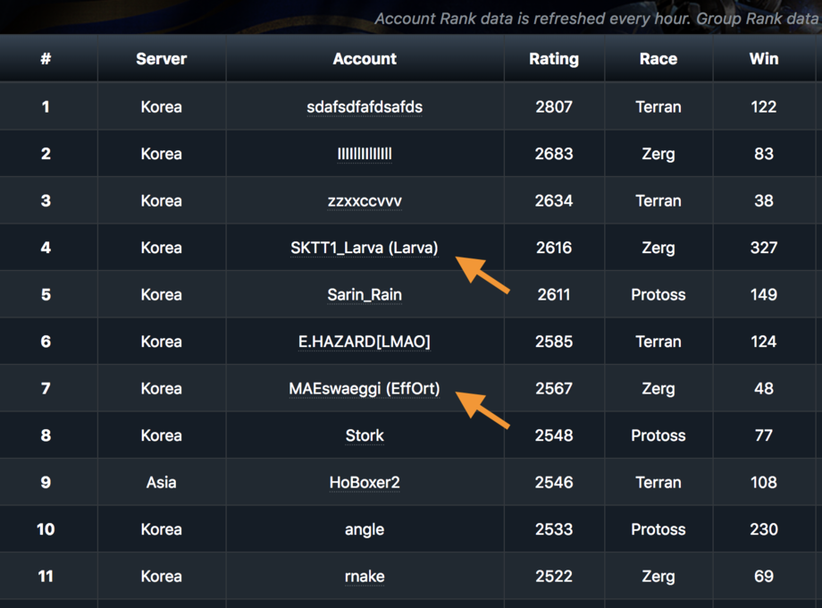

# prosnitch
Chrome Extension to reveal progamer aliases in the starlog.gg Leaderboard

[Link to extension in Chrome Web Store](https://chrome.google.com/webstore/detail/prosnitch/pgdfikogmlokljdbloiihealdikkcdob)

## What it does

This extension only executes when the browser tab is at https://starlog.gg/en/leaderboard*.

When it does execute it will:
1) Load this Liquipedia page: https://liquipedia.net/starcraft/StarCraft_Remastered_Ladder in the background to learn progamer names and aliases
2) Append the progamer name next to the user account, in parentheses.

Step 1 only happens once. Step 2 will happen every time the page changes, so it can update when the [More] button is pressed.

## Notes

- This code is highly dependent on how both Liquipedia and Starlog.gg display their data; please notify me if it stops working
- Please let me know if Starlog.gg starts doing this by itself, so I can add a note here
- Please always review [the code](extension/snitch.js) to double-check I'm not doing something dodgy to your computer
